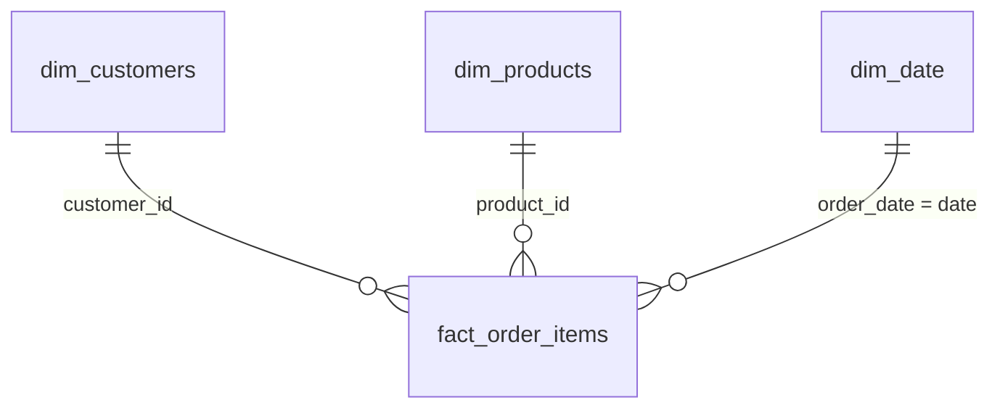

# E-Commerce Q3 2024 Revenue Drop: Root Cause Analysis & Customer Recovery Plan

A SQL and Power BI analytics project investigating why revenue and
customer satisfaction fell sharply in Q3 2024, identifying the
operational root cause, and determining which product categories and
customers should be prioritized for recovery.

------------------------------------------------------------------------

## 🎯 Business Question

Revenue dropped noticeably in Q3 2024. This project investigates three
key business questions:

1.  What caused the revenue and customer satisfaction decline?
2.  Which product categories were hit hardest?
3.  Which customers should be prioritized for a win-back campaign, and
    how much historical revenue do they represent?

------------------------------------------------------------------------

## 🛠️ Tools & Skills

  -----------------------------------------------------------------------
  Tool                                What it was used for
  ----------------------------------- -----------------------------------
  **MySQL**                           Data analysis using CTEs, joins,
                                      aggregations, and window functions

  **SQL Window Functions**            RFM scoring, ranking,
                                      month-over-month analysis, and
                                      customer segmentation

  **Power BI**                        Data modeling and a four-page
                                      interactive business dashboard

  **DAX**                             Revenue, delay percentage, review
                                      score, and customer-risk measures

  **Data Modeling**                   Star schema with fact and dimension
                                      tables

  **Python**                          Synthetic e-commerce dataset
                                      generation

  **GitHub**                          Version control, project
                                      organization, and portfolio
                                      documentation
  -----------------------------------------------------------------------

------------------------------------------------------------------------

## 🗂️ Data Model

The Power BI model follows a star-schema design with `fact_order_items`
at the center and customer, product, and date dimensions surrounding it.



`fact_order_items` is stored at the grain of one product per order.
Customer records also contain RFM (Recency, Frequency, Monetary)
attributes and customer segments calculated during the analysis.


------------------------------------------------------------------------

## 📊 Analysis & Key Findings

### 1. Executive Overview

The executive dashboard provides a high-level view of revenue, average
order value, customer review scores, and delivery performance. It also
allows the analysis to be filtered by quarter and product category.


### 2. Root Cause --- Delivery Delays

The analysis indicates that the decline in customer satisfaction was
strongly associated with a temporary deterioration in delivery
performance.

Orders delivered on time averaged a review score close to **4.4 / 5**,
while orders experiencing major delays of four or more days averaged
approximately **1.8 / 5**.

The percentage of majorly delayed orders increased dramatically during
**July--September 2024**, before returning toward normal levels
afterward. This concentrated three-month window suggests an operational
disruption rather than a gradual long-term decline in customer demand.


#### Business Implication

Improving delivery reliability should be a priority because the analysis
shows a clear relationship between delivery delays and lower customer
satisfaction.

### 3. Product Recovery Priority

Revenue was compared between Q2 and Q3 2024 across product categories.

**Electronics experienced the largest decline**, falling from
approximately **₹28.4 lakh in Q2 to ₹9.5 lakh in Q3**, representing a
decline of roughly **67%**.

Although multiple categories declined during the same period,
Electronics was both the largest revenue category and the category
experiencing the steepest decline.


#### Business Implication

Electronics should receive the highest priority during recovery efforts
because restoring performance in this category offers the greatest
potential revenue impact.

### 4. Customer Recovery Target

RFM segmentation was used to identify customers who previously generated
meaningful business but have recently become inactive.

The analysis identified:

-   **366 customers** in the *At Risk (was loyal)* segment
-   Approximately **23% of the active customer base**
-   Roughly **₹16.04 lakh in historical customer value**


The dashboard also provides a ranked customer table that can be used as
a target list for a win-back campaign.

#### Business Implication

Rather than targeting all inactive customers equally, retention
campaigns can focus first on previously valuable customers who are now
showing signs of churn.

------------------------------------------------------------------------

## 💡 Recommended Recovery Actions

1.  **Investigate the Q3 delivery disruption**
    -   Review logistics and fulfillment performance during
        July--September 2024.
    -   Identify operational causes behind the temporary increase in
        delayed orders.
2.  **Prioritize Electronics recovery**
    -   Investigate inventory, fulfillment, and delivery performance for
        Electronics.
    -   Focus recovery initiatives on the category with the largest
        revenue impact.
3.  **Launch a targeted win-back campaign**
    -   Prioritize the 366 *At Risk (was loyal)* customers.
    -   Rank outreach using historical monetary value and purchase
        frequency.
4.  **Monitor delivery and satisfaction together**
    -   Track delayed-order percentage alongside customer review scores.
    -   Use both metrics as early-warning indicators of future customer
        churn.

------------------------------------------------------------------------

## 📈 Power BI Dashboard Structure

The Power BI report contains four pages, each designed to answer a
different part of the business problem.

  -----------------------------------------------------------------------
  Dashboard Page                      Business Purpose
  ----------------------------------- -----------------------------------
  **Executive Overview**              Monitor revenue, AOV, reviews, and
                                      delivery performance

  **Root Cause: Delivery Delay        Investigate the relationship
  Impact**                            between delivery delays and
                                      satisfaction

  **Product Recovery Priority**       Identify categories experiencing
                                      the largest revenue decline

  **Customer Recovery Target**        Identify high-value customers at
                                      risk of churn
  -----------------------------------------------------------------------

------------------------------------------------------------------------

## ⚙️ How the Analysis Was Built

1.  Designed a relational e-commerce schema covering customers,
    products, orders, order items, payments, and reviews.
2.  Generated and prepared the project dataset.
3.  Used SQL with **CTEs, joins, aggregations, and window functions** to
    analyze revenue trends, customer behavior, and delivery performance.
4.  Created RFM customer segmentation using SQL techniques including
    `NTILE()`.
5.  Calculated month-over-month trends using window functions such as
    `LAG()`.
6.  Created delivery-delay buckets to investigate the relationship
    between fulfillment performance and customer review scores.
7.  Modeled the analytical dataset in Power BI using a star-schema
    design.
8.  Created DAX measures for dashboard KPIs and business metrics.
9.  Built a four-page Power BI report that moves from problem
    identification to root cause and finally to recovery actions.

------------------------------------------------------------------------

## 📁 Repository Structure

``` text
e-commerce-sales-analytics/
│
├── data/
│   └── Raw/source datasets
│
├── images/
│   ├── 01_data_model.png
│   ├── 02_executive_overview.png
│   ├── 03_delivery_delay_analysis.png
│   ├── 04_product_recovery.png
│   └── 05_customer_recovery.png
│
├── PowerBi files/
│   └── Power BI supporting/model files
│
├── python/
│   └── Data generation script
│
├── sql/
│   ├── schema.sql
│   └── ecommerce_sales_analysis.sql
│
└── README.md
```

------------------------------------------------------------------------

## 🚀 Future Improvements

In a production environment, the RFM segmentation could run as a
scheduled data pipeline so customer segments remain current without
manually rerunning SQL queries.

Additional automated data-quality checks could include:

-   Detecting negative or invalid revenue
-   Checking missing customer/product identifiers
-   Validating order and delivery dates
-   Detecting duplicate transactions

The analytical pipeline could also be extended using cloud services for
automated data ingestion, transformation, and dashboard refresh.

------------------------------------------------------------------------

## Project Outcome

This project demonstrates an end-to-end analytics workflow:

**Business Problem → SQL Analysis → Root Cause → Data Modeling → Power
BI → Business Recommendations**

The goal is not only to report what happened, but to translate the
analysis into specific actions for revenue and customer recovery.
