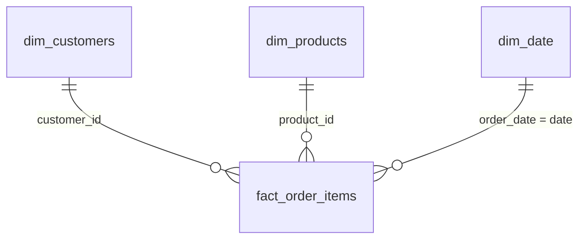
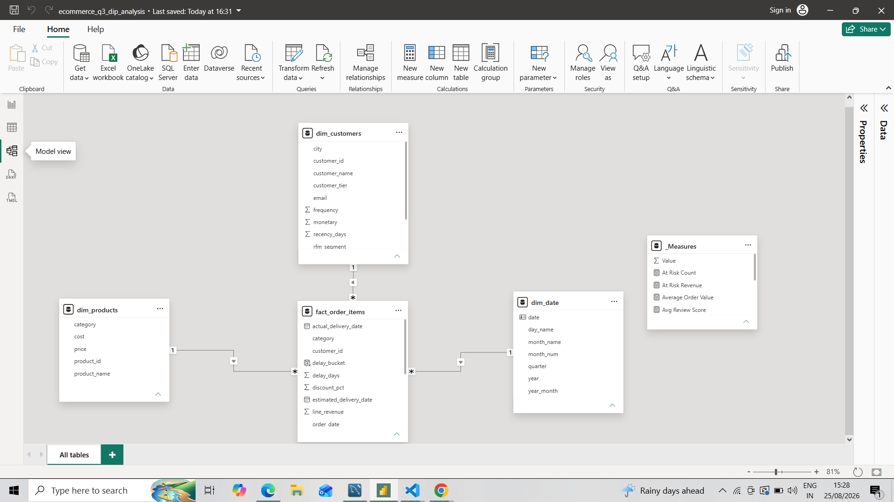
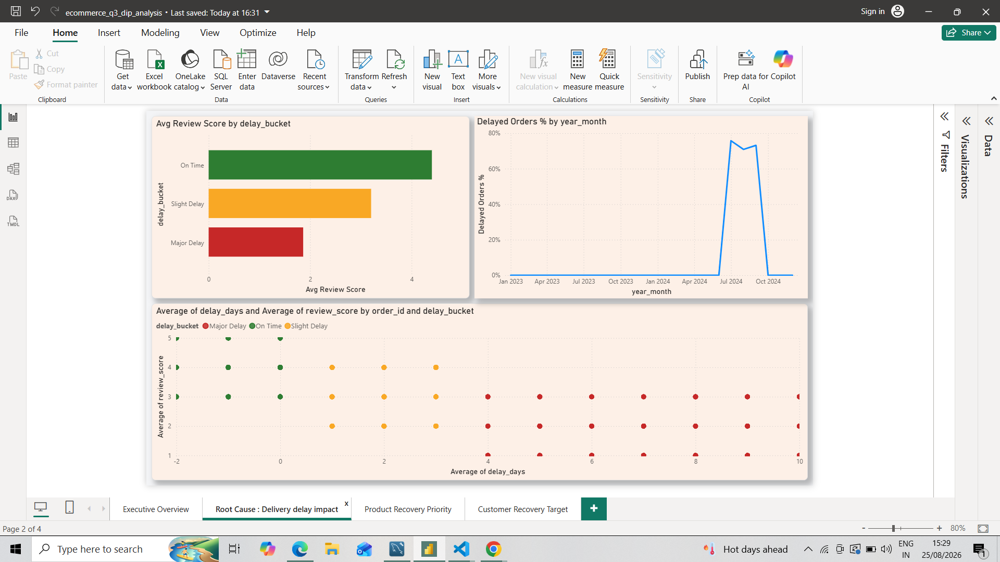
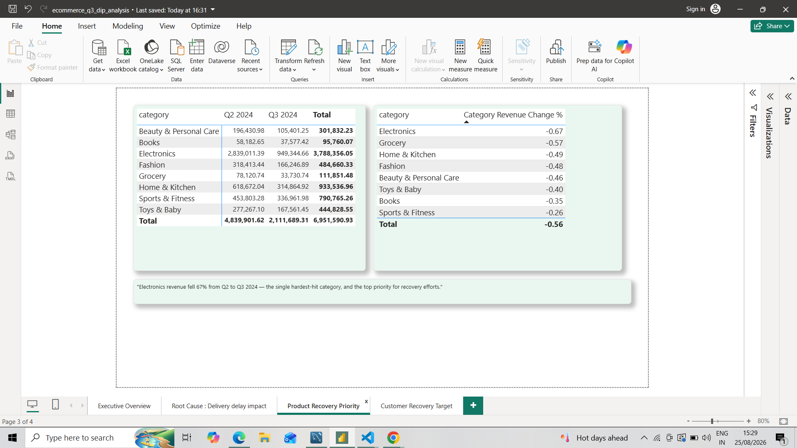
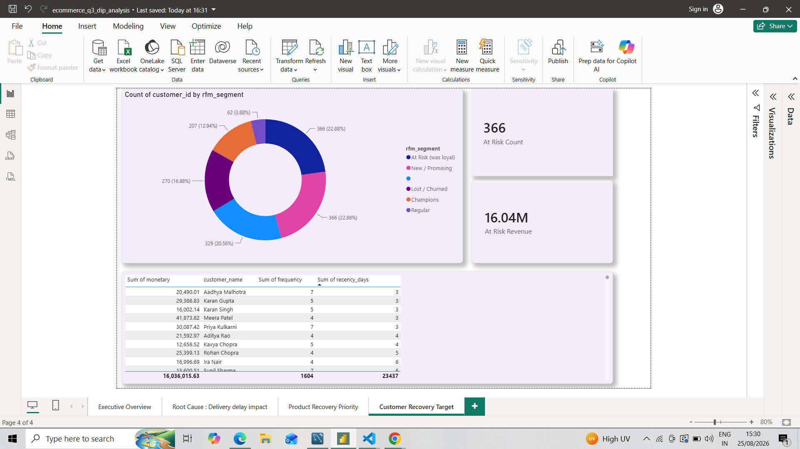
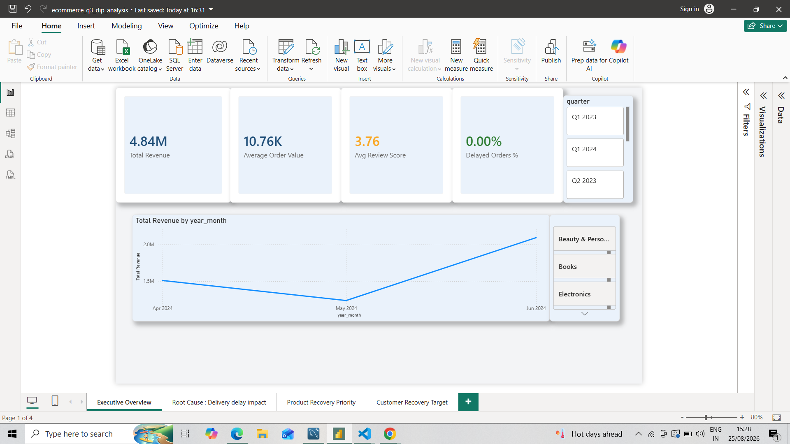

# E-Commerce Q3 2024 Revenue Drop: Root Cause Analysis & Customer Recovery Plan

An end-to-end **data analytics portfolio project** using **SQL, Python, Power BI, DAX, and data modeling** to investigate a sharp decline in e-commerce revenue and customer satisfaction during Q3 2024.

The analysis identifies the likely operational cause of the decline, determines which product categories were affected most, and creates a prioritized customer recovery strategy.

---

## 🎯 Business Problem

An e-commerce retailer experienced a significant decline in **revenue and customer satisfaction during Q3 2024**.

The analysis focuses on three business questions:

1. What caused the revenue and customer satisfaction decline?
2. Which product categories were affected the most?
3. Which customers should be prioritized for a win-back campaign, and how much historical revenue do they represent?

---

## 🛠️ Tech Stack

| Tool | Purpose |
|---|---|
| **SQL / MySQL** | Data analysis, CTEs, joins, aggregations, window functions, RFM segmentation |
| **Python** | Synthetic e-commerce dataset generation and data preparation |
| **Power BI** | Interactive dashboard development and data visualization |
| **DAX** | KPI and business metric calculations |
| **Data Modeling** | Star-schema analytical model |
| **GitHub** | Version control, documentation, and portfolio presentation |

---

## 🗂️ Data Model

The Power BI analytical model follows a **star schema**.



The central `fact_order_items` table is stored at the grain of **one product per order**, with customer, product, and date dimensions surrounding it.

Customer records also contain RFM (**Recency, Frequency, Monetary**) attributes and customer segments calculated during the analysis.



---

# 📊 Key Findings

## 1. Delivery Delays Were the Primary Operational Issue

The analysis found a strong relationship between delivery delays and customer satisfaction.

- Orders delivered **on time** averaged a review score of approximately **4.4 / 5**.
- Orders delayed by **4 or more days** averaged approximately **1.8 / 5**.
- Major delivery delays increased dramatically during **July–September 2024**.
- Delivery performance returned toward normal levels after Q3.

This concentrated three-month disruption suggests an operational delivery issue rather than a gradual long-term decline in customer demand.



### Business implication

Improving delivery reliability should be a priority because delayed deliveries are strongly associated with lower customer satisfaction.

---

## 2. Electronics Was the Highest-Priority Product Category

Revenue was compared between **Q2 and Q3 2024** across product categories.

Electronics experienced the largest decline:

**Q2 Revenue:** approximately ₹28.4 lakh  
**Q3 Revenue:** approximately ₹9.5 lakh  
**Revenue decline:** approximately **67%**

Electronics was both a major revenue contributor and the category experiencing the steepest decline.



### Business implication

Electronics should receive the highest recovery priority because restoring performance in this category offers the greatest potential revenue impact.

---

## 3. 366 High-Value Customers Were Identified as At Risk

RFM segmentation was used to identify customers who historically generated meaningful business but had recently become inactive.

The analysis identified:

- **366 customers** in the `At Risk (was loyal)` segment
- Approximately **23% of the active customer base**
- Approximately **₹16.04 lakh in historical customer value**



The dashboard also contains a ranked customer table that can be used as a direct target list for a win-back campaign.

### Business implication

Instead of targeting all inactive customers equally, retention campaigns can prioritize previously valuable customers who are now showing signs of churn.

---

# 📈 Power BI Dashboard

The Power BI report contains four analytical pages.

### 1. Executive Overview

Provides a high-level view of:

- Revenue
- Order volume
- Average order value
- Customer review scores
- Delivery performance
- Quarter and product-category filters



### 2. Root Cause — Delivery Delay Impact

Investigates the relationship between delivery performance and customer satisfaction using:

- Delay buckets
- Review-score comparisons
- Monthly delay trends
- Supporting visual analysis

### 3. Product Recovery Priority

Compares Q2 and Q3 revenue across product categories and identifies where recovery efforts could have the largest financial impact.

### 4. Customer Recovery Target

Uses RFM segmentation to identify and rank customers who should receive priority in a targeted retention campaign.

---

# 💡 Recommended Business Actions

Based on the analysis:

1. **Investigate the Q3 logistics disruption**
   - Review fulfillment and delivery performance during July–September 2024.
   - Identify operational causes behind the temporary increase in delayed orders.

2. **Prioritize Electronics recovery**
   - Investigate inventory, fulfillment, and delivery performance for Electronics.
   - Focus recovery initiatives on the category with the greatest revenue impact.

3. **Launch a targeted win-back campaign**
   - Prioritize the 366 `At Risk (was loyal)` customers.
   - Rank customers by historical monetary value.
   - Target the highest-value customers first.

4. **Monitor delivery KPIs**
   - Track delayed-order percentage and review scores over time.
   - Create alerts when delivery performance moves outside acceptable thresholds.

---

# 🔍 SQL Analysis

The SQL portion of the project uses techniques including:

- CTEs
- `JOIN`
- `GROUP BY`
- `CASE`
- Aggregate functions
- `LAG()`
- `RANK()`
- `NTILE()`
- Window functions
- Month-over-month analysis
- Revenue analysis
- Delivery-delay segmentation
- Customer RFM segmentation

Example analytical workflow:

```text
Raw Data
   ↓
Relational Database
   ↓
SQL Analysis
   ↓
RFM & Business Metrics
   ↓
Star Schema
   ↓
Power BI + DAX
   ↓
Business Insights
   ↓
Recovery Recommendations
```

---

# ⚙️ How the Project Was Built

1. Designed a relational e-commerce schema covering customers, products, orders, order items, payments, and reviews.
2. Generated and prepared the project dataset using Python.
3. Loaded and analyzed the relational data using MySQL.
4. Used SQL CTEs, joins, aggregations, and window functions to investigate revenue, customers, products, and delivery performance.
5. Created RFM customer segmentation using `NTILE()`.
6. Calculated month-over-month trends using `LAG()`.
7. Created delivery-delay buckets to analyze the relationship between fulfillment performance and customer reviews.
8. Created a star-schema analytical model for Power BI.
9. Built DAX measures for dashboard KPIs.
10. Developed a four-page Power BI report progressing from problem identification to root cause and recovery actions.

---

# 📁 Repository Structure

```text
e-commerce-sales-analytics/
│
├── data/
│   └── Raw/source datasets
│
├── images/
│   ├── 01_data_model.png
│   ├── 02_executive_overview.png
│   ├── 03_delivery_delay_analysis.png
│   ├── 04_product_recovery.png
│   └── 05_customer_recovery.png
│
├── powerbi/
│   ├── README.md
│   ├── dim_customers.csv
│   ├── dim_date.csv
│   ├── dim_products.csv
│   ├── fact_order_items.csv
│   └── ecommerce_powerbi_model.xlsx
│
├── python/
│   └── Dataset generation / preparation
│
├── sql/
│   └── SQL schema and analysis queries
│
└── README.md
```

---

# 🚀 Skills Demonstrated

This project demonstrates practical experience with:

**SQL**
- Analytical queries
- Window functions
- CTEs
- Data aggregation
- Customer segmentation

**Power BI**
- Data modeling
- DAX
- KPI development
- Dashboard design
- Interactive filtering

**Python**
- Dataset generation
- Data preparation

**Analytics**
- Root cause analysis
- Revenue analysis
- Customer segmentation
- Product performance analysis
- Business recommendations

---

## 🔮 Future Improvements

In a production environment, the project could be extended by:

- Automating RFM segmentation through scheduled SQL jobs
- Adding automated data-quality checks
- Creating alerts for abnormal delivery-delay rates
- Automating the data pipeline
- Publishing the dashboard through Power BI Service
- Adding cloud storage and processing using AWS
- Tracking customer recovery campaign results

---

## 🎥 Project Walkthrough

A short 2–3 minute project walkthrough can be added here after recording the dashboard and explaining:

**Business problem → SQL analysis → Power BI dashboard → key findings → recommendations**

---

## 👤 Author

**Ankit Saraswat**

Aspiring Data Analyst | SQL | Python | Power BI | Data Analytics
